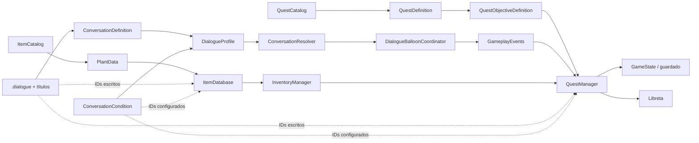

# Auditoría de arquitectura narrativa y referencias

## Resumen ejecutivo

El sistema narrativo no presenta actualmente duplicación grave de responsabilidades. Hay un único `QuestManager`, un único índice narrativo y catálogos canónicos claros para misiones, conversaciones e ítems. El validador actual encuentra **0 errores y 0 avisos** en los recursos que indexa.

La principal fuente de complejidad es la **autoría de referencias cruzadas mediante texto**:

- el índice narrativo conoce misiones y conversaciones, pero no las 20 plantas del `ItemCatalog`;
- las condiciones guardan IDs válidos, pero el inspector no ofrece selección encadenada misión → objetivo;
- los archivos `.dialogue` contienen comandos con IDs que el validador no analiza;
- no existe una vista inversa «usado por», por lo que renombrar exige buscar manualmente.

La recomendación es conservar los IDs como identidad estable para guardado y eventos, y reducir su escritura manual mediante índice, validación, selectores y navegación. Sustituirlos globalmente por rutas o referencias directas trasladaría el problema y acoplaría el runtime a la organización de archivos.

## Estado auditado

| Dominio | Fuente canónica | Inventario actual | Validación actual |
|---|---|---:|---|
| Catálogos de misiones | `resources/quests/catalogs/*.tres` | 1 (`loop_1`) | IDs duplicados, recursos nulos y definiciones |
| Misiones | `QuestDefinition` | 2 | ID, objetivos, grupos y referencias internas |
| Objetivos | Embebidos en cada `QuestDefinition` | 3 | ID, evento, target y cantidad |
| Conversaciones | `ConversationDefinition` | 9 | ID, recurso `.dialogue` y `start_title` |
| Perfiles | `DialogueProfile` | 4 | Entradas, duplicados locales y fallback |
| Plantas | `resources/items/item_catalog.tres` | 20 | Validación separada en `ItemDatabase` |
| Títulos de diálogo | Líneas `~ title` en `.dialogue` | 21 | Solo se comprueban cuando los usa una `ConversationDefinition` |

### Identidades declaradas

**Misiones y objetivos**

- `00_old_woman_tutorial`
  - `tutorial_collect_malva`
  - `tutorial_deliver_malva`
- `01_collect_first_herbs`
  - `collect_dedaleira`

**Conversaciones**

- `final_firelight_conversation`
- `font_conversation`
- `old_woman_first_meeting`
- `old_woman_tutorial_completed`
- `old_woman_tutorial_delivery`
- `old_woman_tutorial_reminder`
- `school_board_conversation`
- `terrace_poster_conversation`
- `wind_conversation`

**Perfiles**

- `font`
- `old_woman`
- `school_board`
- `terrace_poster`

**Plantas**

- `dedaleira`, `fento`, `fiuncho`, `herba_luisa`, `hiperico`
- `hortensia`, `ipomea`, `macela`, `malva`, `menta`
- `mimosa`, `ortiga`, `pan-de-cuco`, `pe-de-boi`, `pervinca`
- `romeu`, `ruda`, `silveira`, `tominho`, `xesta`

`plastic_bottle` también pertenece al `ItemCatalog`, pero no es una planta.

### Títulos de Dialogue Manager

| Archivo | Títulos |
|---|---|
| `intro.dialogue` | `start` |
| `info.dialogue` | `plant_collected`, `final_game_intro`, siete resultados de cacho y `final_player_removed_invasors` |
| `example.dialogue` | `start` |
| `scene1/firelight.dialogue` | `final_firelight_talk` |
| `scene1/oldwoman.dialogue` | `first_meeting`, `tutorial_quest_reminder`, `tutorial_quest_delivery`, `tutorial_quest_completed` |
| `scene1/school_board.dialogue` | `start` |
| `scene2/terrace_poster.dialogue` | `start` |
| `scene2/wind_and_font.dialogue` | `wind_blowing`, `font` |

`other.dialogue` contiene texto auxiliar/traducible, pero no declara títulos. `example.dialogue` no tiene consumidores del juego localizados y parece material de ejemplo. Los títulos de `intro.dialogue` e `info.dialogue` se consumen fuera de `ConversationDefinition`, mediante `game_root` y `DialogueBalloonCoordinator`.

## Mapa de dependencias



Las flechas discontinuas son los puntos de mayor fricción: son referencias textuales correctas en runtime, pero carecen de navegación o selección segura durante la autoría.

## Flujos narrativos principales

### Un diálogo inicia una misión

```text
oldwoman.dialogue
  → QuestManager.start_quest("00_old_woman_tutorial")
  → QuestState pasa de INACTIVE a ACTIVE
  → quest_started / quest_updated
  → la libreta reconstruye sus entradas visibles
```

La referencia a la misión vive como texto dentro de `.dialogue`; actualmente no se indexa ni valida.

### Un evento completa un objetivo

```text
CollectablePlant
  → GameplayEvents.plant_collected(plant_id, collection_id, amount)
  → QuestManager compara evento, tipo de target y target_id
  → advance_objective(quest_id, objective_id)
  → objective_completed / quest_updated
```

Para `PLANT_SPECIES`, el target debería existir en `ItemCatalog`. Para `PLANT_INSTANCE`, el target es un `collection_id` declarado en una escena y no existe aún un catálogo global.

### Una condición desbloquea una conversación

```text
DialogueProfile
  → ConversationEntry.conditions
  → QuestStatusCondition / QuestObjectiveCompletedCondition / InventoryHasPlantCondition
  → ConversationResolver descarta entradas no elegibles
  → selecciona la entrada regular de mayor prioridad o un fallback
```

El validador comprueba referencias a misión, objetivo y conversación, pero no comprueba todavía `InventoryHasPlantCondition.plant_id` contra `ItemCatalog`.

### La libreta representa el progreso

```text
QuestDefinition
  → objetivos técnicos
  → grupos descriptivos opcionales
  → NotebookPanel deriva líneas individuales, agrupadas u ocultas
  → el estado siempre se consulta en QuestManager
```

Los grupos no duplican progreso ni estado guardado. Sus `objective_ids` son referencias internas a la misma misión y ya se validan.

## Referencias actuales y puntos de copia manual

| Referencia | Declaración | Consumidores observados | Autoría actual | Cobertura |
|---|---|---|---|---|
| `quest_id` | `QuestDefinition` | guardado, condiciones, grupos de diálogo y comandos `.dialogue` | Selector parcial y texto | Validado salvo comandos `.dialogue` |
| `objective_id` | Objetivo embebido | guardado, condiciones, grupos, `submit_item` | Selector en grupos; texto en condiciones/comandos | Validado en recursos, no en comandos |
| `conversation_id` | `ConversationDefinition` | perfiles, historial, objetivos, escenas y eventos | Selector en creador de objetivos; texto en escenas | Bien cubierto en recursos narrativos |
| `start_title` | `ConversationDefinition` o llamada directa | Dialogue Manager | Texto | Validado dentro de conversaciones; llamadas directas fuera del índice |
| `plant_id` | `PlantData.id` | inventario, objetivos, condiciones y comandos `.dialogue` | Principalmente texto | Fuera del índice narrativo |
| `collection_id` | Instancia de planta en escena | objetivos `PLANT_INSTANCE` y eventos | Texto | Sin índice global |
| `fragment_id` | Fragmento embebido en `PlantData` | Florilexio y comandos `.dialogue` | Texto | Validación local, no comandos |
| `profile_id` | `DialogueProfile` | documentación y diagnóstico | Generado/configurado una vez | Riesgo bajo; escenas usan recurso directo |
| `catalog_id` | `QuestCatalog` | registro y documentación | Configurado una vez | Riesgo bajo |

### Copias concretas localizadas

- `oldwoman.dialogue` contiene dos llamadas a `QuestManager.start_quest` y una a `QuestManager.submit_item`.
- El mismo archivo contiene ocho llamadas con IDs a `FlorilexioManager.unlock_knowledge`, además de `plastic_bottle` en `InventoryManager.add_item`.
- `old_woman_profile.tres` repite `00_old_woman_tutorial` en cuatro condiciones y combina una de ellas con `tutorial_collect_malva`.
- `old_woman_profile.tres` escribe manualmente `malva` en `InventoryHasPlantCondition`.
- `park.tscn` escribe `wind_conversation` en `required_finished_conversation_id`.
- Los objetivos de plantas almacenan `malva`, `malva_tutorial` y `dedaleira` como `target_id`.

No se han encontrado referencias rotas en el conjunto que cubre `NarrativeValidator`. Sí existen **puntos ciegos**: comandos `.dialogue`, plantas, fragmentos de conocimiento, títulos llamados directamente y `collection_id` de escenas.

## Riesgo de renombrado

| Tipo | Riesgo | Motivo | Política recomendada |
|---|---|---|---|
| Misión | Alto | Aparece en guardados, condiciones y comandos | Tratar como identidad persistente; renombrar con herramienta de migración |
| Objetivo | Alto | Aparece en guardados, grupos, condiciones y comandos | Igual que misión; siempre contextualizado por `quest_id` |
| Conversación | Alto | Aparece en historial guardado, perfiles, escenas y objetivos | Mantener estable; migración explícita si cambia |
| Planta/ítem | Alto | Aparece en inventario guardado, objetivos, conocimiento y comandos | Mantener estable; no derivarlo del nombre visible |
| Título `.dialogue` | Medio | Rompe el arranque de una conversación o llamada directa | Validación cruzada y herramienta de búsqueda antes de renombrar |
| Fragmento de conocimiento | Medio | Es local a una planta, pero se llama desde `.dialogue` | Contextualizar siempre con `plant_id` y validar comandos |
| `collection_id` | Medio | Es local a escenas y objetivos por instancia | Evitarlo salvo que la identidad de la instancia sea realmente necesaria |
| Perfil/catálogo | Bajo | Pocos consumidores y predominan referencias directas a recursos | Mantener ID para diagnóstico, sin ampliar su uso textual |

Los IDs guardados no deberían cambiar por correcciones estéticas. Los nombres y descripciones visibles pueden cambiar libremente.

## Responsabilidades actuales

| Componente | Responsabilidad correcta | No debería asumir |
|---|---|---|
| `QuestManager` | Registrar definiciones, mantener estado, reaccionar a eventos, guardar y consultar progreso | Presentación del cuaderno, creación de contenido o búsqueda global de referencias |
| `QuestDefinition` | Declarar identidad, clasificación, objetivos y presentación descriptiva | Estado mutable de la partida |
| `DialogueProfile` / `ConversationResolver` | Elegir conversación según condiciones, prioridad y fallback | Modificar directamente el progreso de misiones |
| `DialogueBalloonCoordinator` | Ejecutar conversaciones y publicar su finalización | Resolver condiciones o registrar misiones |
| `GameplayEvents` | Transportar hechos del juego con IDs estables | Conocer catálogos o lógica de progreso |
| `NarrativeIndex` | Descubrir recursos narrativos y ofrecer búsquedas canónicas | Convertirse en dependencia del runtime |
| `NarrativeValidator` | Detectar inconsistencias antes de ejecutar el juego | Reparar o migrar recursos automáticamente |
| Plugin narrativo | Crear recursos, ofrecer selectores, validar y facilitar navegación | Reemplazar el inspector, Dialogue Manager o los managers del juego |

La separación es adecuada. La simplificación debe concentrarse en el plugin y el análisis estático, no en fusionar managers.

## Propuesta priorizada

### Pequeñas — alto retorno y bajo riesgo

1. **Indexar `ItemCatalog` en `NarrativeIndex`.**
   - Problema: plantas y otros ítems son canónicos, pero el plugin no los conoce.
   - Resultado: selector de planta para targets `PLANT_SPECIES` e `ITEM_SUBMITTED`, y para `InventoryHasPlantCondition`.
   - Riesgo: bajo; no cambia runtime ni recursos.

2. **Ampliar la validación de referencias a plantas e ítems.**
   - Comprobar targets de objetivos, condiciones de inventario y entradas manuales del creador.
   - Mantener `PLANT_INSTANCE` separado: requiere índice de escenas o validación contextual.

3. **Añadir «usado por» a la documentación generada.**
   - Por cada misión, objetivo, conversación y planta, listar recurso consumidor, campo y ubicación.
   - Resultado: entender relaciones y estimar un renombrado sin búsquedas manuales.

### Medianas — siguiente iteración recomendada

4. **Selectores encadenados misión → objetivo.**
   - Un selector de misión limita el selector de objetivos a esa definición.
   - Aplicarlo al creador/editor de condiciones narrativas y a cualquier herramienta de acciones.
   - Los recursos siguen guardando IDs; solo cambia la experiencia de autoría.

5. **Indexar comandos conocidos de `.dialogue`.**
   - Analizar de forma conservadora llamadas literales a `QuestManager`, `InventoryManager` y `FlorilexioManager`.
   - Validar IDs y añadirlos al grafo «usado por».
   - Las expresiones dinámicas se marcan como no analizables, sin pretender interpretar todo el lenguaje.

6. **Generador de fragmentos de comando.**
   - Elegir una acción y sus recursos mediante selectores y copiar una línea válida para Dialogue Manager.
   - Acciones iniciales: iniciar misión, entregar ítem y desbloquear conocimiento.
   - Reduce errores sin introducir una segunda capa de ejecución.

### Estructurales — posponer hasta que el contenido lo justifique

7. **Renombrado transaccional de IDs.**
   - Mostrar consumidores, actualizar recursos y comandos analizables, y registrar migración de guardado.
   - Coste y riesgo altos; útil cuando haya mucho contenido estable.

8. **Referencias tipadas de autoría.**
   - Considerar un `QuestObjectiveReference` reutilizable para inspectores complejos.
   - Internamente seguiría resolviendo `quest_id + objective_id`; no debe reemplazar la identidad persistente.

9. **Índice de identidades de escena.**
   - Solo si crece el uso de `PLANT_INSTANCE`, ubicaciones o interactuables.
   - Evitar crear un catálogo global antes de necesitar referencias frecuentes entre escenas.

## Orden recomendado de trabajo

```text
1. ItemCatalog en NarrativeIndex
2. Validación de plantas/ítems
3. Informe «usado por»
4. Selectores misión → objetivo
5. Análisis y generación de comandos .dialogue
6. Reevaluar si sigue haciendo falta un refactor estructural
```

Los tres primeros pasos resolverían gran parte de la confusión sin alterar el juego. Tras ellos, el plugin podría convertirse en el punto de entrada para crear y navegar contenido, mientras que los recursos y managers actuales permanecerían simples.

## Criterios para futuros cambios

- Mantener un único propietario para cada estado mutable.
- Mantener IDs estables en guardados y eventos.
- Preferir selectores y validación a eliminar IDs del modelo.
- No crear catálogos para identidades que solo viven dentro de una escena y no se referencian desde fuera.
- Toda nueva referencia textual debería indicar su fuente canónica y aparecer en «usado por».
- Un refactor estructural debe eliminar una responsabilidad duplicada o un fallo real; reducir tecleo corresponde primero a herramientas de autoría.

## Verificación de la auditoría

- El inventario coincide con la documentación narrativa generada el 17 de agosto de 2026: 2 misiones, 3 objetivos, 9 conversaciones, 4 perfiles y ningún problema detectado.
- Las 20 plantas se contrastaron con `resources/items/item_catalog.tres` y sus `PlantData`.
- Los 21 títulos se contrastaron con las declaraciones `~` de los archivos `.dialogue`.
- Las referencias concretas se contrastaron mediante búsqueda en `.gd`, `.tres`, `.tscn` y `.dialogue`.
- Las conversaciones sin perfil no son huérfanas: `wind_conversation` se usa directamente en `park.tscn` y `final_firelight_conversation` desde `game_hud.gd`.
- Los puntos ciegos enumerados no se presentan como errores actuales, sino como referencias aún no cubiertas por el índice y el validador.
