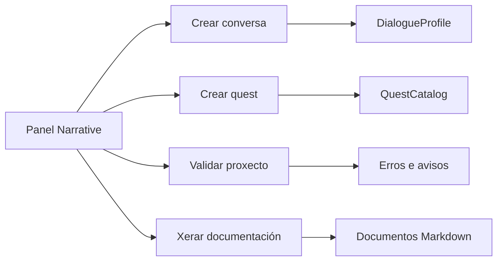
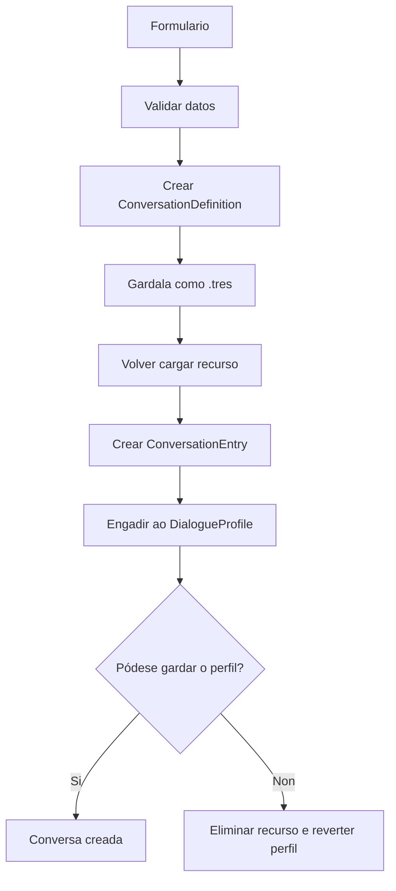

# Manual das ferramentas narrativas

> [!abstract]
> O plugin **Florilexio - Xestión narrativa** permite crear conversas, crear quests, validar os recursos narrativos do proxecto e xerar documentación Markdown indexada.
>
> A ferramenta non substitúe Dialogue Manager nin o inspector de Godot. Automatiza a creación e conexión dos recursos máis repetitivos e detecta configuracións inconsistentes antes de que cheguen ao xogo.

---

# Que permite facer

Desde o panel **Narrative** do editor pódese:

- crear unha `ConversationDefinition`;
- engadila automaticamente a un `DialogueProfile`;
- configurar prioridade, repetición e fallback;
- crear unha `QuestDefinition`;
- engadir un ou varios `QuestObjectiveDefinition`;
- engadir a quest a un `QuestCatalog`;
- seleccionar conversas existentes como target dun obxectivo;
- validar conversas, perfís, quests, catálogos e referencias;
- abrir desde o listado o recurso que produce un erro;
- xerar índices Markdown de conversas, quests e validación.



---

# Activación do plugin

## 1. Abrir os plugins do proxecto

En Godot:

```text
Proxecto
→ Axustes do proxecto
→ Plugins
```

## 2. Activar o plugin

Buscar:

```text
Florilexio - Xestión narrativa
```

e cambiar o seu estado a **Activado**.

O plugin está situado en:

```text
res://addons/florilexio_narrative_tools/
```

## 3. Localizar o panel

Ao activalo aparecerá un dock chamado:

```text
Narrative
```

na zona dereita do editor.

Se non aparece:

1. comprobar que o plugin está activado;
2. revisar a consola de Godot;
3. desactivar e activar outra vez o plugin;
4. reiniciar o editor se Godot aínda non actualizou os scripts `@tool`.

---

# Interfaz principal

O panel mostra catro accións:

```text
Crear conversa
Crear quest
Validar proxecto
Xerar documentación
```

Debaixo aparece:

- un resumo da última validación ou xeración;
- unha árbore cos erros, avisos e mensaxes informativas.

Só pode estar aberto á vez un dos dous formularios de creación:

- conversa;
- quest.

Ao crear un recurso correctamente:

1. actualízase o sistema de ficheiros de Godot;
2. ábrese o recurso creado no inspector;
3. execútase automaticamente unha nova validación.

---

# Fluxo de traballo recomendado

## Para unha conversa nova

```text
1. Crear ou preparar o arquivo .dialogue
2. Crear a ConversationDefinition coa ferramenta
3. Engadir condicións no inspector, se son necesarias
4. Validar o proxecto
5. Probar a resolución no xogo
```

## Para unha quest nova

```text
1. Definir o fluxo narrativo
2. Comprobar que existen os IDs que se van referenciar
3. Crear a QuestDefinition coa ferramenta
4. Validar o proxecto
5. Probar inicio, progreso, carga e finalización
```

> [!tip]
> A ferramenta crea a estrutura. A lóxica narrativa concreta continúa vivindo nos arquivos `.dialogue`, nas condicións das entradas e nos sistemas de gameplay que publican eventos.

---

# Crear unha conversa

Premer:

```text
Crear conversa
```

Isto abre o formulario de creación.

## Campos

### Personaxe/NPC

Nome do personaxe ou propietario principal da conversa.

Exemplo:

```text
old_woman
```

Este valor úsase para propoñer o `conversation_id`. Non se garda como unha propiedade separada do recurso.

### Arco narrativo

Bloque, misión ou tema ao que pertence a conversa.

Exemplo:

```text
mallow_quest
```

### Propósito

Función concreta da conversa dentro do arco.

Exemplos:

```text
offer
reminder
delivery
completed
ambient
```

### Conversation ID

Identificador global e estable da conversa.

A ferramenta propóñeo automaticamente combinando:

```text
<personaxe>_<arco>_<propósito>
```

Exemplo:

```text
old_woman_mallow_quest_delivery
```

O ID normalízase automaticamente:

- convértese a minúsculas;
- substitúe espazos e símbolos por `_`;
- elimina acentos;
- elimina `_` duplicados;
- elimina `_` ao principio e ao final.

Exemplo:

```text
Vella · Misión Malva · Entrega
```

convértese en:

```text
vella_mision_malva_entrega
```

> [!warning]
> O `conversation_id` forma parte das referencias e do historial persistido. Non se debe renomear alegremente unha vez usado en contido ou partidas gardadas.

### Arquivo `.dialogue`

Recurso de Dialogue Manager que contén o texto.

O botón **Seleccionar** abre o explorador en:

```text
res://dialogues
```

Só acepta ficheiros:

```text
*.dialogue
```

A ferramenta comproba que o recurso cargado sexa un `DialogueResource`.

### Start title

Título do arquivo `.dialogue` desde o que comeza a conversa.

Valor por defecto:

```text
start
```

Exemplo:

```text
~ delivery
```

debe configurarse como:

```text
delivery
```

> [!important]
> A ferramenta non crea nin modifica automaticamente o contido do ficheiro `.dialogue`. O título debe existir ou ser engadido manualmente en Dialogue Manager.

### Initial speaker ID

`speaker_id` do nodo sobre o que aparece inicialmente o balloon.

Exemplo:

```text
old_woman
```

Debe coincidir co ID dun `DialogueSpeaker` dispoñible cando se execute a conversa.

### Prioridade

Número usado por `ConversationResolver` para escoller entre varias entradas dispoñibles.

Un valor máis alto ten preferencia.

Convención orientativa:

| Prioridade | Uso |
|---:|---|
| `100` | escena ou entrega obrigatoria |
| `80` | hito narrativo |
| `60` | oferta de quest |
| `40` | recordatorio |
| `10` | reacción ambiental |
| `0` | fallback simple |

A ferramenta permite valores negativos e positivos amplos. A convención debe manterse coherente dentro do proxecto.

### Repetible

Marcar cando a conversa pode volver aparecer aínda que xa rematase normalmente.

Exemplos habituais:

- recordatorios;
- diálogos ambientais;
- respostas neutras;
- información que pode consultarse varias veces.

Non marcar para:

- presentación inicial;
- revelación única;
- oferta que non debe repetirse;
- escena de finalización.

### Fallback

Marca a entrada como conversa de respaldo.

Os fallback só se consideran cando non hai ningunha entrada normal dispoñible.

Uso habitual:

```text
Un saúdo neutro ou unha liña ambiental
```

> [!tip]
> En xeral, cada perfil debería ter un único fallback repetible.

### DialogueProfile destino

Perfil ao que se engadirá a nova entrada.

A lista constrúese a partir dos `DialogueProfile` encontrados dentro de:

```text
res://resources/dialogues
```

Ao seleccionar un perfil, a ferramenta propón como carpeta inicial a carpeta dese recurso.

### Carpeta de gardado

Carpeta onde se gardará a `ConversationDefinition`.

A ferramenta propón o nome:

```text
<conversation_id>.tres
```

Exemplo:

```text
res://resources/dialogues/town_square/old_woman/quest_mallow/
old_woman_mallow_quest_delivery.tres
```

## Que crea exactamente

Ao premer **Crear conversa**, a ferramenta:

1. valida a solicitude;
2. crea unha `ConversationDefinition`;
3. gárdaa como `.tres`;
4. volve cargar o recurso gardado;
5. crea unha `ConversationEntry`;
6. asigna prioridade, repetición e fallback;
7. engade a entrada ao `DialogueProfile`;
8. garda o perfil;
9. desfai a operación se o perfil non se pode gardar.



## Que non crea

A ferramenta non crea automaticamente:

- o texto da conversa;
- un novo `DialogueProfile`;
- condicións da entrada;
- un NPC;
- un `DialogueSpeaker`;
- unha quest asociada;
- traducións.

As condicións deben engadirse despois no inspector do perfil.

---

# Exemplo: conversa de entrega

## Ficheiro `.dialogue`

```text
~ delivery

old_woman: Trouxéchesme a malva?
player: Aquí está.
do QuestManager.submit_item(
    &"old_woman_mallow",
    &"deliver_mallow",
    &"malva",
    1
)
old_woman: Xa podo preparar o bebedizo.
=> END
```

## Formulario

```text
Personaxe/NPC: old_woman
Arco narrativo: mallow_quest
Propósito: delivery
Conversation ID: old_woman_mallow_quest_delivery
Arquivo .dialogue: res://dialogues/old_woman/mallow_quest.dialogue
Start title: delivery
Initial speaker ID: old_woman
Prioridade: 100
Repetible: non
Fallback: non
DialogueProfile destino: old_woman
Carpeta: res://resources/dialogues/old_woman/mallow_quest
```

## Despois da creación

No inspector do `DialogueProfile`, engadir á entrada as condicións necesarias, por exemplo:

- quest activa;
- obxectivo de recollida completado;
- malva dispoñible no inventario.

---

# Crear unha quest

Premer:

```text
Crear quest
```

Isto abre o formulario de quest.

## Quest ID

Identificador global e estable da misión.

Exemplo:

```text
old_woman_mallow
```

Tamén se normaliza automaticamente antes de crear o recurso.

## Catálogo destino

`QuestCatalog` ao que se engadirá a nova misión.

A lista constrúese cos catálogos encontrados dentro de:

```text
res://resources/quests
```

Exemplo:

```text
loop_1
```

## Obxectivos

O formulario comeza cun obxectivo.

Pódense engadir máis con:

```text
Engadir obxectivo
```

E eliminar con:

```text
Eliminar obxetivo
```

Cada obxectivo convértese nun `QuestObjectiveDefinition` embebido dentro da quest.

---

# Configurar un obxectivo

## Objective ID

ID estable e único dentro da quest.

Exemplos:

```text
collect_mallow
deliver_mallow
inspect_school_notice
report_to_old_woman
```

Non identifica o elemento do mundo. Identifica o paso da misión.

## Event type

Feito que pode avanzar o obxectivo.

A lista procede directamente de:

```gdscript
QuestObjectiveDefinition.EventType
```

Tipos actuais:

| Event type | Uso |
|---|---|
| `NONE` | sen configurar; non debe quedar así |
| `PLANT_COLLECTED` | recoller unha planta |
| `DIALOGUE_COMPLETED` | rematar unha conversa |
| `INTERACTABLE_USED` | usar un interactuable |
| `LOCATION_REACHED` | chegar a unha localización |
| `ITEM_SUBMITTED` | presentar ou entregar un obxecto segundo a lóxica do runtime |

> [!note]
> Que un tipo apareza no editor non implica necesariamente que o seu evento xa estea conectado en runtime. Antes de usalo, comproba que `GameplayEvents` e `QuestManager` o procesan.

## Target type

Tipo de entidade que se compara co evento.

A lista dispoñible cambia segundo o `event_type`.

A ferramenta consulta:

```gdscript
QuestObjectiveDefinition.get_allowed_target_types(event_type)
```

Se só hai un tipo permitido, selecciónase automaticamente.

Tipos actuais:

| Target type | Significado |
|---|---|
| `NONE` | sen configurar |
| `PLANT_SPECIES` | calquera planta da especie |
| `PLANT_INSTANCE` | unha instancia concreta |
| `CONVERSATION` | unha conversa concreta |
| `INTERACTABLE` | un interactuable concreto |
| `LOCATION` | unha localización concreta |

## Target existente

Actualmente aparece para:

```text
CONVERSATION
```

Permite escoller un `conversation_id` xa indexado.

Ao seleccionalo, cópiase ao campo `Target ID`.

## Target ID

ID concreto contra o que se compara o evento.

Exemplos:

```text
malva
malva_tutorial
old_woman_mallow_report
school_notice_board
park
```

A entrada manual permanece dispoñible, o que permite referenciar contido que aínda non foi creado. Nese caso, a validación pode mostrar unha referencia descoñecida.

## Required amount

Cantidade necesaria para completar o obxectivo.

Valor por defecto:

```text
1
```

Rango actual:

```text
1–999
```

---

# Exemplos de obxectivos

## Recoller calquera malva

```text
Objective ID: collect_mallow
Event type: PLANT_COLLECTED
Target type: PLANT_SPECIES
Target ID: malva
Required amount: 1
```

## Recoller a malva tutorial concreta

```text
Objective ID: collect_tutorial_mallow
Event type: PLANT_COLLECTED
Target type: PLANT_INSTANCE
Target ID: malva_tutorial
Required amount: 1
```

## Rematar unha conversa

```text
Objective ID: report_to_old_woman
Event type: DIALOGUE_COMPLETED
Target type: CONVERSATION
Target ID: old_woman_mallow_report
Required amount: 1
```

## Usar un cartel

```text
Objective ID: inspect_school_notice
Event type: INTERACTABLE_USED
Target type: INTERACTABLE
Target ID: school_notice_board
Required amount: 1
```

## Entregar ou presentar un obxecto

```text
Objective ID: present_mallow
Event type: ITEM_SUBMITTED
Target type: PLANT_SPECIES
Target ID: malva
Required amount: 1
```

> [!warning]
> O consumo ou conservación do obxecto depende da implementación do runtime. A ferramenta só crea a definición do obxectivo.

---

# Gardar a quest

## Carpeta de gardado

Seleccionar unha carpeta dentro de:

```text
res://resources/quests
```

A ferramenta propón:

```text
<quest_id>.tres
```

Exemplo:

```text
res://resources/quests/loop_1/old_woman_mallow.tres
```

## Que crea exactamente

Ao premer **Crear quest**, a ferramenta:

1. normaliza o `quest_id`;
2. constrúe todos os `QuestObjectiveDefinition`;
3. valida a definición;
4. comproba que o ID non exista;
5. comproba referencias a conversas;
6. crea unha `QuestDefinition`;
7. gárdaa como `.tres`;
8. volve cargar o recurso;
9. engádeo ao catálogo;
10. garda o catálogo;
11. revérteo todo se o catálogo non se pode gardar.

## Que non crea

A ferramenta non crea:

- conversas de oferta, recordatorio ou entrega;
- condicións de diálogo;
- eventos de gameplay;
- código para iniciar a misión;
- código de entrega;
- textos para HUD ou diario;
- prerequisitos entre obxectivos.

---

# Validar o proxecto

Premer:

```text
Validar proxecto
```

A ferramenta reconstrúe `NarrativeIndex` e executa `NarrativeValidator`.

O resumo mostra:

```text
N conversacións · N perfís · N quests
N erros · N warnings · N info
```

## Severidades

### ERROR

Configuración inválida ou referencia rota.

Debe corrixirse antes de considerar o contido listo.

### WARNING

Situación potencialmente sospeitosa, pero que pode ser intencionada.

Exemplos:

- perfil sen fallback;
- varios fallback;
- prioridades compartidas.

### INFO

Información útil que non representa un erro.

## Abrir o recurso afectado

Facer dobre clic nun elemento da lista.

Se o problema ten unha ruta asociada:

1. cargarase o recurso;
2. abrirase no inspector de Godot.

A ruta completa tamén aparece como tooltip sobre a mensaxe.

---

# Que valida actualmente

## Recursos locais

Cada recurso delega na súa propia API:

```gdscript
get_validation_errors()
```

Isto aplícase a:

- `ConversationDefinition`;
- `DialogueProfile`;
- `QuestDefinition`;
- `QuestCatalog`.

## IDs duplicados

Detecta duplicados de:

- `conversation_id`;
- `quest_id`;
- `catalog_id`.

## Perfís de diálogo

Detecta:

- ausencia de fallback;
- máis dun fallback;
- varias entradas normais coa mesma prioridade.

> [!note]
> Compartir prioridade non sempre produce un erro funcional, pero pode facer que a selección dependa da orde das entradas.

## Referencias das condicións

Comproba referencias de:

- `QuestStatusCondition`;
- `QuestObjectiveCompletedCondition`;
- `ConversationFinishedCondition`.

Pode detectar:

- quest inexistente;
- obxectivo inexistente dentro dunha quest;
- conversa inexistente.

## Targets de conversa nos obxectivos

Para obxectivos con:

```text
Target type: CONVERSATION
```

comproba que o `conversation_id` exista.

---

# Que non valida aínda

O índice actual só percorre:

```text
res://resources/dialogues
res://resources/quests
```

Non indexa polo momento:

- `speaker_id` das escenas;
- `interactable_id`;
- `plant_id`;
- `collection_id`;
- `location_id`.

Por tanto, a ferramenta non pode comprobar aínda se estes IDs existen realmente.

Tampouco comproba necesariamente:

- que o `start_title` exista dentro do `.dialogue`;
- que o speaker inicial estea presente na escena;
- que un evento estea conectado no runtime;
- que unha condición sexa narrativamente alcanzable;
- que dúas condicións se contradigan;
- que unha conversa poida quedar bloqueada por outra de maior prioridade;
- que un `ITEM_SUBMITTED` consuma ou non o obxecto.

---

# Xerar documentación

Premer:

```text
Xerar documentación
```

A ferramenta:

1. reconstrúe o índice;
2. executa a validación;
3. crea tres documentos Markdown;
4. refresca o sistema de ficheiros de Godot.

## Carpeta de saída

```text
res://docs/Documentacion
```

## Nomes dos ficheiros

Levan un prefixo coa data do sistema:

```text
AAMMDD-conversations.md
AAMMDD-quests.md
AAMMDD-narrative-validation.md
```

Exemplo:

```text
260801-conversations.md
260801-quests.md
260801-narrative-validation.md
```

> [!warning]
> Se se xera a documentación varias veces o mesmo día, os ficheiros coa mesma data serán sobrescritos.

## Documento de conversas

Inclúe:

| Columna | Contido |
|---|---|
| Conversation ID | ID global |
| Profile | perfil que a referencia |
| Dialogue | ruta do `.dialogue` |
| Start title | punto de entrada |
| Speaker | speaker inicial |
| Priority | prioridade da entrada |
| Repeatable | se é repetible |
| Fallback | se é fallback |

Se unha mesma conversa aparece en varios perfís ou entradas, pode xerar varias filas.

## Documento de quests

Inclúe unha táboa xeral:

| Columna | Contido |
|---|---|
| Quest ID | ID global |
| Catalog | catálogos que a conteñen |
| Objectives | número de obxectivos |
| Resource | ruta do recurso |

Despois engade unha sección por quest cos seus obxectivos:

| Objective ID | Event | Target type | Target ID | Required |
|---|---|---|---|---:|

## Documento de validación

Inclúe:

- número de conversas;
- número de perfís;
- número de quests;
- número de obxectivos;
- erros;
- warnings;
- info;
- táboa completa de incidencias.

## Uso con Obsidian

Como a saída está dentro de:

```text
docs/
```

pódese abrir directamente desde o vault de Obsidian.

Estes ficheiros son xerados automaticamente e inclúen a advertencia:

```text
Generated file. Do not edit manually.
```

Non deben conter documentación explicativa escrita a man. Para iso deben usarse outras notas do vault.

---

# Índice narrativo

`NarrativeIndex` percorre recursivamente:

```text
res://resources/dialogues
res://resources/quests
```

e indexa ficheiros:

```text
.tres
.res
```

Actualmente recoñece:

- `ConversationDefinition`;
- `DialogueProfile`;
- `QuestDefinition`;
- `QuestCatalog`;
- obxectivos embebidos nas quests.

## Implicacións para organizar os recursos

Para que un recurso apareza no editor, validación ou documentación:

- debe estar gardado;
- debe estar dentro dunha das raíces indexadas;
- debe usar `.tres` ou `.res`;
- debe cargar correctamente;
- debe ser dunha das clases recoñecidas.

Un `DialogueProfile` gardado fóra de:

```text
res://resources/dialogues
```

non aparecerá no selector de perfís.

Un `QuestCatalog` gardado fóra de:

```text
res://resources/quests
```

non aparecerá no selector de catálogos.

---

# Erros frecuentes

## «target_profile is null»

Non se seleccionou un `DialogueProfile`.

Solución:

```text
Seleccionar DialogueProfile destino
```

## «target_profile has not been saved»

O perfil existe en memoria, pero non ten `resource_path`.

Solución:

- gardar o perfil como `.tres`;
- actualizar o selector;
- tentalo de novo.

## «conversation_id already exists»

Xa existe unha conversa co mesmo ID.

Solución:

- cambiar o ID;
- comprobar se realmente se quería engadir outra entrada que reutilizase a conversa existente;
- non duplicar a definición.

## «quest_id already exists»

Xa existe unha quest co mesmo ID.

Solución:

- cambiar o ID;
- abrir a quest existente;
- comprobar se se está creando por duplicado.

## «save_path is empty»

Non se seleccionou carpeta de gardado ou o ID está baleiro.

Solución:

1. cubrir o ID;
2. seleccionar unha carpeta;
3. comprobar a ruta proposta.

## «save_path must be inside res://»

Seleccionouse unha ruta externa ao proxecto.

A ferramenta só escribe dentro de:

```text
res://
```

## «save_path must use the .tres extension»

A ruta de saída non remata en `.tres`.

Seleccionar unha carpeta e deixar que a ferramenta xere o nome.

## «a resource already exists»

Xa hai un ficheiro na ruta proposta.

A ferramenta non sobrescribe recursos existentes durante a creación.

## «objective refers to unknown conversation»

Un obxectivo `CONVERSATION` usa un ID que non aparece no índice.

Solución:

- crear antes a conversa;
- seleccionar unha conversa existente;
- corrixir o ID;
- manter o ID manual só se o recurso se vai crear inmediatamente despois.

## O perfil non aparece no selector

Comprobar que:

- está gardado;
- é un `DialogueProfile`;
- está baixo `res://resources/dialogues`;
- non ten erros de carga;
- se volveu abrir o formulario para refrescar a lista.

## O catálogo non aparece no selector

Comprobar que:

- está gardado;
- é un `QuestCatalog`;
- está baixo `res://resources/quests`;
- se volveu abrir o formulario para refrescar a lista.

## Non aparece unha conversa na documentación

Comprobar:

- ruta dentro de `resources/dialogues`;
- extensión `.tres` ou `.res`;
- clase `ConversationDefinition`;
- recurso gardado e cargable.

## A validación non detecta unha planta inexistente

É unha limitación actual.

O índice aínda non percorre o rexistro de especies nin as instancias das escenas.

---

# Boas prácticas

## Crear primeiro os recursos que van ser referenciados

Orde recomendada:

```text
ConversationDefinition
→ QuestDefinition que a referencia
→ condicións que referencian quest ou obxectivo
```

Así os selectores e a validación teñen información completa.

## Usar IDs descritivos e estables

Bo:

```text
old_woman_mallow_delivery
tutorial_collect_mallow
school_notice_board
```

Pouco recomendable:

```text
dialogue_3
objective_2
thing
```

## Non usar o nome visible como ID

Os textos poden traducirse e cambiar.

Os IDs deberían permanecer estables:

```text
old_woman
```

mentres o nome visible pode ser:

```text
Mundo
A vella Mundo
Dona Mundo
```

## Un único fallback por perfil

A ferramenta só avisa, pero a convención debería ser:

```text
0 ou 1 fallback
```

Normalmente:

```text
1 fallback repetible
```

## Evitar prioridades duplicadas sen intención

Se dúas entradas normais teñen a mesma prioridade, o resultado pode depender da orde.

Usar números separados:

```text
100
80
60
40
20
```

deixa espazo para introducir novas entradas.

## Validar antes de facer commit

Fluxo recomendado:

```text
Crear ou editar recursos
→ Validar proxecto
→ Corrixir ERROR
→ Revisar WARNING
→ Xerar documentación
→ Probar en xogo
→ Commit
```

## Non editar os índices xerados

Os documentos con data son unha fotografía do estado do proxecto.

As explicacións manuais deben vivir en notas separadas.

## Revisar o inspector despois da creación

A ferramenta crea propiedades comúns, pero aínda pode ser necesario engadir:

- condicións;
- referencias;
- valores específicos novos;
- metadatos introducidos en futuras versións.

---

# Limitacións actuais da ferramenta

- Non crea arquivos `.dialogue`.
- Non engade títulos aos `.dialogue`.
- Non crea novos perfís.
- Non crea novos catálogos.
- Non edita condicións.
- Non crea eventos de gameplay.
- Non proba a resolución dunha conversa.
- Non executa quests.
- Non renomea IDs de forma segura.
- Non busca referencias globais antes dun renomeado.
- Non indexa plantas, instancias, interactuables, localizacións nin speakers.
- O selector de target existente só está implementado para conversas.
- Non ofrece aínda modelos predefinidos de misión.
- Non crea documentación narrativa redactada, só índices.
- Non substitúe as probas dentro do xogo.

---

# Extensibilidade

A ferramenta está deseñada para delegar as regras locais nas definicións.

Por exemplo:

```gdscript
QuestObjectiveDefinition.get_allowed_target_types(event_type)
```

determina as combinacións permitidas no formulario.

E:

```gdscript
resource.get_validation_errors()
```

mantén a validación interna no propio recurso.

Isto permite engadir no futuro propiedades como:

```text
consume_item
item_requirement_mode
required_objective_ids
optional
hidden
```

sen reescribir todo o plugin.

Ao ampliar o sistema:

1. engadir a propiedade ao recurso;
2. actualizar a súa validación;
3. actualizar o runtime;
4. engadir o control específico ao formulario só se é necesario;
5. actualizar a documentación xerada se esa propiedade debe aparecer no índice.

---

# Lista de comprobación: conversa nova

- [ ] Existe o arquivo `.dialogue`.
- [ ] Existe o `start_title`.
- [ ] O `speaker_id` é correcto.
- [ ] O `conversation_id` é estable.
- [ ] Seleccionouse o perfil correcto.
- [ ] Configurouse a prioridade.
- [ ] Configurouse repetición.
- [ ] Configurouse fallback.
- [ ] Engadíronse condicións no inspector.
- [ ] A validación non mostra erros.
- [ ] Probouse no xogo.

# Lista de comprobación: quest nova

- [ ] O `quest_id` é estable.
- [ ] O catálogo é correcto.
- [ ] Cada `objective_id` é único.
- [ ] Cada evento está implementado en runtime.
- [ ] Cada target usa o tipo correcto.
- [ ] As conversas referenciadas existen.
- [ ] A quest se inicia desde algún fluxo.
- [ ] As conversas teñen condicións coherentes.
- [ ] Probouse o progreso de cada obxectivo.
- [ ] Probouse a finalización.
- [ ] Probouse gardado e carga.
- [ ] A validación non mostra erros.
- [ ] Xerouse a documentación.

---
## Responsabilidades

| Ficheiro | Responsabilidade |
|---|---|
| `narrative_tools_plugin.gd` | integración co editor |
| `narrative_tools_dock.gd` | interface principal |
| `conversation_creator_panel.gd` | formulario de conversa |
| `quest_creator_panel.gd` | formulario de quest |
| `quest_objective_editor.gd` | edición dun obxectivo |
| `resource_factory.gd` | validación e creación transaccional |
| `narrative_index.gd` | indexado de recursos |
| `narrative_validator.gd` | validación global |
| `narrative_documentation_generator.gd` | xeración de Markdown |
| `run_narrative_validation.gd` | execución manual desde EditorScript |

---

> [!note]
> Manual baseado na versión `1.0.0` do plugin **Florilexio - Xestión narrativa**, revisada o 1 de agosto de 2026.